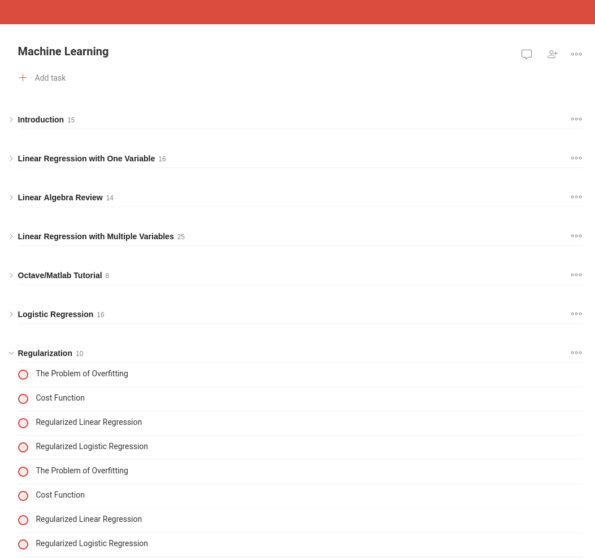

# moocist

moocist downloads a syllabus of a given [MOOC](https://en.wikipedia.org/wiki/Massive_open_online_course)
and converts in into [Todoist](https://todoist.com/) template CSV file, ready to import.
**Currently Moocist supports only MOOCs from Coursera.**

## Installation

#### Via Go

```shell
$ go get github.com/hryniuk/moocist
```

## Usage

```shell
$ moocist -help
Usage:
        ./moocist <course URL or slug>
  -priority int
        priority of generated tasks 4 (grey) - 1 (red)
```

## Example

As an example let's take
[Fundamentals of Graphic Design](https://www.coursera.org/learn/fundamentals-of-graphic-design) course.

Course URL: https://www.coursera.org/learn/fundamentals-of-graphic-design

Moocist accepts both different forms of the course's URL and course slug. All these strings
passed as an argument to `moocist` command should work and produce the file with
the same content:

* `https://www.coursera.org/learn/fundamentals-of-graphic-design`
* `www.coursera.org/learn/fundamentals-of-graphic-design`
* `coursera.org/learn/fundamentals-of-graphic-design#enroll`
* `fundamentals-of-graphic-design`

and this command:

```shell
$ moocist https://www.coursera.org/learn/fundamentals-of-graphic-design
```

will produce a Todoist CSV [template file](https://todoist.com/templates/)
which results in the following project setup in Todoist:


