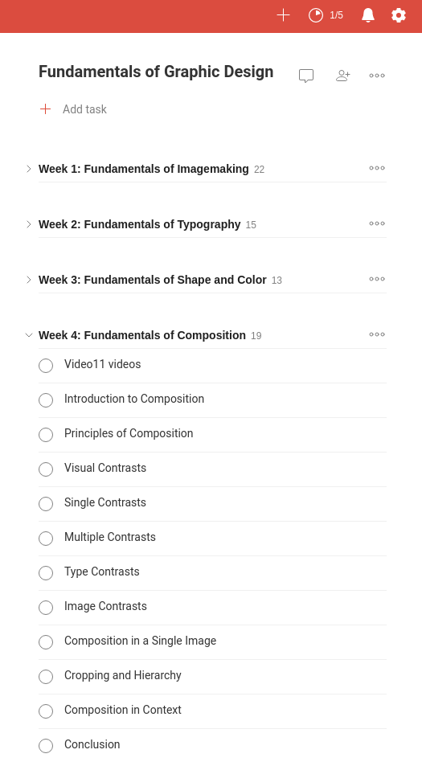

# moocist

moocist downloads a syllabus of a given [MOOC](https://en.wikipedia.org/wiki/Massive_open_online_course)
and converts in into [Todoist](https://todoist.com/) template CSV file, ready to import.

## Installation

#### Via Go

```shell
$ go get github.com/hryniuk/moocist
```

## Usage

```shell
moocist  --help
moocist is tool for converting MOOCs into Todoist template.

Usage:
  moocist [command]

Available Commands:
  help        Help about any command
  import      Import MOOC into JSON file
  template    Create a Todoist CSV template for given MOOC

Flags:
  -h, --help   help for moocist

Use "moocist [command] --help" for more information about a command.
```

## Example

As for now, Moocist supports only MOOCs from Coursera.
To save a syllabus of a given course in the CSV file, pass
a course slug (last part of the URL) as an argument
to the template command.

#### [Machine Learning](https://www.coursera.org/learn/machine-learning) on Coursera

URL: https://www.coursera.org/learn/machine-learning

Command:

```shell
$ moocist template --coursera-slug machine-learning > machine-learning.csv
```

Gives the following project setup:


